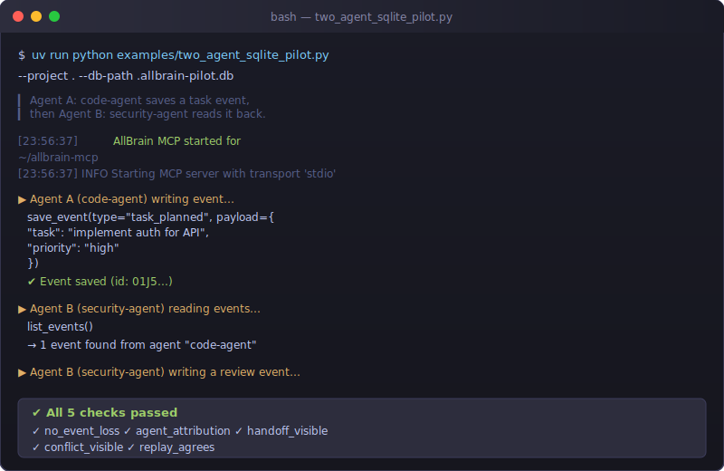

# AllBrain Agent Runtime

One brain. Many agents. One shared memory.




## Without AllBrain vs with AllBrain

| Scenario | Without AllBrain | With AllBrain |
|---|---|---|
| Agent A saves a plan | Written to local chat history, immediately lost when session ends | Appended to shared event store via `save_event()` |
| Agent B starts the same project | Fresh context — no knowledge of Agent A's work | `resume_project()` returns full event history |
| Two agents write conflicting changes | Silent overwrite, no one knows | `detect_conflicts()` surfaces both versions |
| Handoff between agents | Manual copy-paste of context | `list_events()` with agent filter shows handoff trail |
| Debugging state drift | "It worked in my session" | Deterministic replay from raw events, exactly reproducible |

## The problem

Your AI coding agents don't talk to each other. Agent A saves a plan, Agent B starts fresh, Agent C has no idea what happened. Each agent works in isolation, repeating mistakes and missing context.

AllBrain gives every agent a shared workbench. Each tool call is recorded in an append-only event store. When the next agent arrives, it sees everything that happened before — events, sessions, conflicts, decisions — and picks up cleanly.

## What AllBrain gives you

- **Shared memory** — `save_event`, `list_events`, `resume_project` across any MCP client
- **Agent attribution** — every event is tagged with the agent that wrote it
- **Conflict detection** — automatic surface of conflicting state updates
- **Decision pipelines** — counterfactual reasoning, scenario planning, foresight
- **Deterministic replay** — rebuild project state from raw events
- **50 tools** in full profile across 18 domain modules (start with 3, enable more as needed)

## 30-second demo

```shell
# Agent A: save a plan
uv run allbrain start --project . --agent agent-a
# In Agent A's client, call:
#   save_event(type="task_planned", payload={"task": "implement auth"})
```

```shell
# Agent B: see what Agent A did
uv run allbrain start --project . --agent agent-b
# In Agent B's client, call:
#   list_events()
#   resume_project()
```

See [`examples/two_agent_sqlite_pilot.py`](examples/two_agent_sqlite_pilot.py) for a full two-agent workflow with conflict detection and replay verification.

## Install for one client

The PyPI distribution is `allbrain-agent-runtime`. The canonical CLI command is
`allbrain`; `allbrain-mcp` and `allbrain-agent-runtime` remain compatibility
aliases for existing installations and scripts.

```shell
uvx allbrain-agent-runtime install --codex
```

This configures Codex to start AllBrain automatically. Replace `--codex` with the client name:

| Client | Flag |
|---|---|
| Codex | `--codex` |
| Claude Code | `--claude` |
| OpenCode | `--opencode` |
| Cursor | `--cursor` |
| VS Code | `--vscode` |
| Zed | `--zed` |
| Gemini CLI | `--gemini` |
| Kiro | `--kiro` |
| Windsurf | `--windsurf` |
| Antigravity | `--antigravity` |
| Claude Desktop | `--claude-desktop` |

Use `--all` to configure every supported client at once.

### Verify it works

```shell
uvx allbrain-agent-runtime install --codex --verify
```

The `--verify` flag starts the server, saves a test event, reads it back, and confirms shared memory is working.

### Tool profiles

Start with `--tool-profile minimal` (3 tools) and expand when needed:

| Profile | Tools | Use when |
|---|---|---|
| `minimal` | save_event, list_events, resume_project | Getting started |
| `memory` | minimal + retrieve_memory | Need recall |
| `collaboration` | memory + task/conflict/resolution tools | Multi-agent handoff |
| `reasoning` | memory + decision pipeline tools | Planning and analysis |
| `core` | save_event, list_events, retrieve_memory, git_info, create_task, get_task_graph, orchestrate_project, run_decision_pipeline, create_snapshot, resume_project | Essential workflow |
| `full` | 50 tools | Everything |

```shell
uv run allbrain start --project . --agent my-agent --tool-profile memory
```

## Glama MCP Portal

Glama MCP evaluates this server with the balanced **core tool profile**
(`--tool-profile core` in `glama.json`). Its 11 public tools cover shared
memory, task orchestration, snapshots, Git context, and decision workflows
without exposing the entire development surface.

Yerel geliştirme veya tüm yetenekleri kullanmak için `full` profili kullanın:

```bash
uv run allbrain start --project . --agent claude-code --tool-profile full
```

Alternatif olarak `.mcp.json` (varsayılan `full` ile gelir) kullanılabilir.

### From source

```shell
git clone https://github.com/Mustafa-Ali-Ertugrul/allbrain-mcp.git
cd allbrain-mcp
uv sync
./scripts/install-mcp.sh --all --isolate --verify
```

Or run the guided onboarding wizard:

```shell
uv run allbrain onboard
```

It walks you through client selection, install, verification, and your first event step by step.

See the [full setup guide](docs/setup.md) for manual config, troubleshooting, and shared-vs-isolated databases.

## First memory save

Once AllBrain is installed and the client is restarted, call:

```text
save_event(type="task_started", payload={"task": "implement auth", "agent": "codex"})
```

Then verify it was recorded:

```text
list_events()
```

Switch to another client, call `list_events()` again — the same event appears.

## Tool count and supported clients

> **Note:** Glama evaluates the balanced 11-tool `core` profile. The full profile remains available for local development.

- 51 tools in the full MCP profile across 18 domain tool modules
- Default profile (`full`) registers all tools
- `minimal` profile: 3 tools (`save_event`, `list_events`, `resume_project`)
- `core` profile: 11 tools (essential workflow + reasoning + context pack)

## What's New in v0.2.3

### 1. Concurrency Hardening (Queue & Session)
* **Atomic Queue Idempotency:** `QueueCoordinator` now utilizes `open_write_session` (SQLite `BEGIN IMMEDIATE`) and catches `IntegrityError` to safely handle concurrent task enqueues from multi-agent worker pools.
* **Narrowed Lock Contention:** `ensure_session_started` lock boundaries are optimized. Heavy Git fingerprinting and DB event logging are moved outside the main context locks, drastically improving throughput.
* **Git Observer Cache:** Active session tracking now caches `_recorded_git_keys` in the execution context, eliminating redundant O(n) database queries of session events on every tool call.

### 2. Security & Redaction Updates
* **OpenAI Key Boundary:** Regex pattern updated to target greedy bounds (`{40,}` minimum length) for robust secret redaction while preventing false positives.
* **Recursion Guard:** A hard limit of `_MAX_SANITIZE_DEPTH = 32` prevents stack overflow attacks on deeply nested malicious payloads.
* **Env Variable Prefixing:** Standardized path limits environment variable to `ALLBRAIN_ALLOWED_PROJECT_ROOTS` (with deprecation fallback).
* **Double Sanitization:** Resource endpoints now re-sanitize persisted events before exposure, providing defense-in-depth against data leakage.

## Data lifecycle and security

AllBrain stores events, sessions, and audit logs in local SQLite. Data never leaves your machine. Credential-like values are redacted before storage.

- [Data lifecycle](docs/data-lifecycle.md) — what is stored, retention, cleanup, restore
- [Uninstall guide](docs/uninstall.md) — remove AllBrain from clients and delete data

## Advanced docs

- [Full setup guide](docs/setup.md) — all clients, shared vs isolated databases, troubleshooting
- [Custom agent integration](docs/custom-agent-integration.md) — use AllBrain from any MCP client
- [Python SDK](packages/allbrain-sdk/README.md) — typed async client (experimental)
- [Architecture](docs/ARCHITECTURE.md) — event sourcing, reducers, stream ordering, pipeline, bounded contexts
- [Storage backends](docs/database_scaling_policy.md) — SQLite vs PostgreSQL vs queue adapters
- [Package maturity](docs/package-maturity.md) — production core vs opt-in vs experimental packages
- [Multi-agent pilot](docs/two-agent-pilot.md) — two-agent workflow walkthrough
- [Upgrade guide](docs/upgrade-guide.md) — migrations, rollback, breaking changes
- [Community examples](docs/community-examples.md) — real user setups, terminal output, workflows

## Status

- 2849 passed tests, 3 skipped tests (highly robust)
- stdio MCP handshake verified
- Python 3.12+ (CI at 3.13)
- Coverage: 80.72% (enforced threshold 80%)
