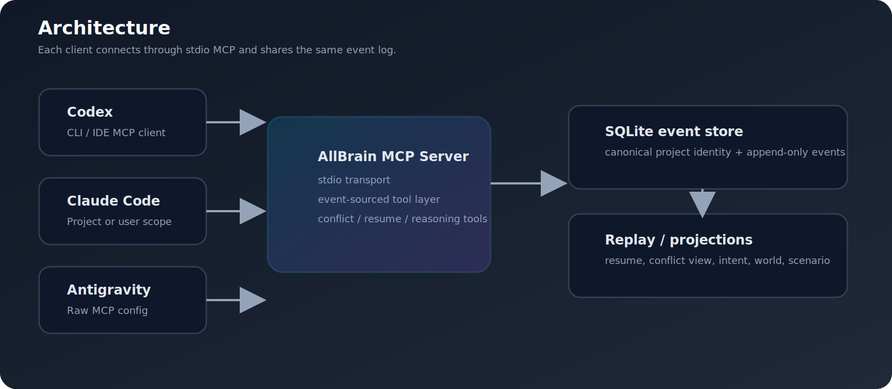
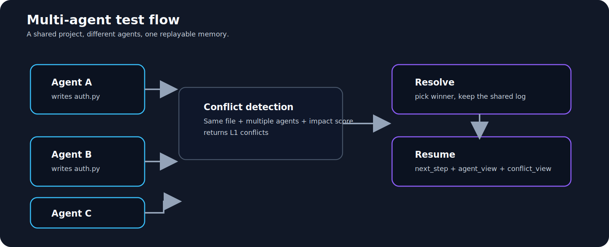

# AllBrain MCP

One brain. Many agents. One shared memory.


AllBrain MCP is an event-sourced memory and orchestration server for multi-agent work. It captures what each agent did, replays the shared state, and helps the next agent pick up cleanly.

## What it gives you

- FastMCP stdio server
- append-only event log on SQLite
- stable UUIDv7 event ordering
- session-bound agent attribution
- `save_event()`, `list_events()`, `resume_project()`
- conflict detection and resolution
- semantic intent extraction
- world, counterfactual, and scenario reasoning
- deterministic replay from raw events

## Visuals





## Quick start

```powershell
uv run allbrain start --project . --agent codex
```

For the easiest MCP setup after cloning:

```powershell
.\scripts\install-mcp.ps1 -All
```

That installs or refreshes the client configs for Codex, Claude Code, OpenCode, and Antigravity.

If you want a clean local setup:

1. create a venv
2. install the project
3. start the server with `allbrain start`
4. connect your MCP client to the stdio command

See [docs/setup.md](docs/setup.md) for the client-specific details.

## Example flow

1. Agent A writes an event.
2. Agent B writes to the same project.
3. Agent C opens the project and gets the merged view.
4. Conflicts are surfaced instead of being hidden.

## Why this repo is useful

- Good for shared agent memory
- Good for cross-client MCP testing
- Good for deterministic orchestration experiments
- Good for debugging multi-agent state drift

## Reality check

This is a real MCP server with real tool calls and real state replay.

It still does not make the model magically autonomous. Some pipelines simulate execution rather than performing live world actions.

## Repo layout

- `src/allbrain/` - server, runtime, reducers, and tools
- `tests/` - coverage for the event-sourced flows
- `docs/` - setup notes and architecture writeups
- `docs/images/` - GitHub-friendly visuals

## Status

- 251 tests passing
- stdio MCP handshake verified
- multi-agent write/read/conflict flows verified
