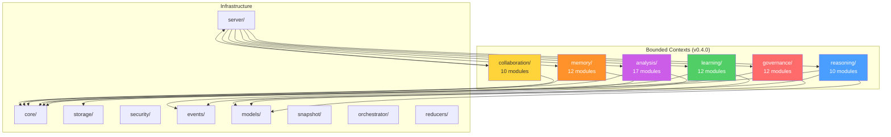

# AllBrain Architecture — Bounded Contexts

This document maps the 73 top-level domain packages into 6 bounded
contexts. The `allbrain.domains.*` namespace (created in v0.3.0)
is the forward-compatible home for the eventual mass migration, which lands
in **v0.4.0**. Phase 1 (v0.3.0) is **scaffold + docs only**:
no module moves yet.

## Dependency Rule (Golden Rule)

- Bounded contexts MAY depend only on **infrastructure**: `core/`, `models/`,
  `events/`, `storage/`, `security/`, `server/`, `snapshot/`, `orchestrator/`,
  `reducers/`, `config/`, `cli/`, `install/`, `ops/`.
- **Cross-context imports are FORBIDDEN.** If two contexts need to
  share logic, that logic moves into `core/` or `models/`.

> `orchestrator/` and `reducers/` are explicitly exempt from the rule:
> they are cross-cutting infrastructure layers (scheduling + reducers), not
> domains. The reducer files (`reducers/<domain>.py`) already mirror
> these context boundaries internally.

## Infrastructure (untouched)

| Package | Role |
|---|---|
| `core/` | Event-sourcing core (state_engine, state_machine, merge) |
| `storage/` | DB layer (database, repository, snapshot_repo) |
| `security/` | Redaction, rate limiting, input guard |
| `events/` | Event type definitions, domain matching |
| `models/` | SQLModel entities, Pydantic schemas |
| `server/` | MCP server (app, context, lifecycle, tools/) |
| `snapshot/` | SnapshotEngine, SnapshotBuilder |
| `orchestrator/` | Task graph, scheduling, handoff (infrastructure) |
| `reducers/` | Cross-cutting reducer layer (infrastructure) |
| `config.py` | Path validation, configuration |
| `cli/` | CLI entry point |
| `install/` | Client installer |
| `ops/` | Operational tooling |

## Bounded Contexts

### `domains.reasoning/` — decision-making & forward thinking (10)

| Module | Current Path | Key Exports |
|---|---|---|
| counterfactual | `allbrain.counterfactual` | `CounterfactualEngine`, `AlternativeRanker` |
| scenarios | `allbrain.scenarios` | `ScenarioEngine`, `ScenarioAnalysis` |
| foresight | `allbrain.foresight` | `ForesightInput`, generation |
| meta_reasoning | `allbrain.meta_reasoning` | meta-reasoning |
| uncertainty | `allbrain.uncertainty` | `observed_success_rate` |
| decision | `allbrain.decision` | decision pipeline |
| information_seeking | `allbrain.information_seeking` | `InformationSeekingManager` |
| intent | `allbrain.intent` | `IntentExtractor`, `IntentStore` |
| objective_system | `allbrain.objective_system` | objective mgmt |
| tradeoff_engine | `allbrain.tradeoff_engine` | tradeoff analysis |

### `domains.governance/` — safety, alignment, self-repair (12)

| Module | Current Path | Key Exports |
|---|---|---|
| policy | `allbrain.policy` | `RoutingEngine` |
| policy_competition | `allbrain.policy_competition` | competing policies |
| policy_routing | `allbrain.policy_routing` | policy selection |
| value_alignment | `allbrain.value_alignment` | value alignment |
| governance | `allbrain.governance` | `AutonomousGovernanceCoordinator` |
| self_repair | `allbrain.self_repair` | self-repair |
| soft_repair | `allbrain.soft_repair` | soft repair |
| adaptive_recovery | `allbrain.adaptive_recovery` | adaptive recovery |
| recovery_consensus | `allbrain.recovery_consensus` | recovery consensus |
| mitigation_learning | `allbrain.mitigation_learning` | mitigation learning |
| reliability | `allbrain.reliability` | `ReliabilityMetrics` |
| resilience | `allbrain.resilience` | resilience |

### `domains.learning/` — meta-learning & adaptation (12)

| Module | Current Path | Key Exports |
|---|---|---|
| learning | `allbrain.learning` | `CapabilityLearningManager` |
| learning_graph | `allbrain.learning_graph` | learning graph |
| learning_safety | `allbrain.learning_safety` | safe learning |
| meta_optimizer | `allbrain.meta_optimizer` | meta-optimizer |
| meta_scoring | `allbrain.meta_scoring` | meta-scoring |
| meta_meta_scoring | `allbrain.meta_meta_scoring` | meta-meta-scoring |
| meta_policy | `allbrain.meta_policy` | meta-policy |
| calibration | `allbrain.calibration` | calibration |
| capabilities | `allbrain.capabilities` | capability tracking |
| evolution | `allbrain.evolution` | evolutionary strategies |
| coevolution | `allbrain.coevolution` | co-evolution |
| self_play | `allbrain.self_play` | self-play |

### `domains.collaboration/` — multi-agent coordination (10)

| Module | Current Path | Key Exports |
|---|---|---|
| collaboration | `allbrain.collaboration` | `CollaborationManager` |
| conflict | `allbrain.conflict` | `ConflictDetector`, `ConflictResolver` |
| merge | `allbrain.merge` | `EventMergeEngine`, `StateMerger` |
| arbitration | `allbrain.arbitration` | `ArbitrationManager` |
| reputation | `allbrain.reputation` | reputation |
| distributed | `allbrain.distributed` | distributed coordination |
| workflow | `allbrain.workflow` | `WorkflowSnapshotBuilder` |
| workspace | `allbrain.workspace` | shared workspace |
| agents | `allbrain.agents` | agent management |
| routing | `allbrain.routing` | routing |

### `domains.analysis/` — situation understanding & anomaly (17)

| Module | Current Path | Key Exports |
|---|---|---|
| causal | `allbrain.causal` | `simulate_intervention` |
| belief | `allbrain.belief` | `BeliefManager` |
| evidence | `allbrain.evidence` | evidence |
| contradiction | `allbrain.contradiction` | `ContradictionDetector` |
| drift | `allbrain.drift` | drift detection |
| dynamics | `allbrain.dynamics` | capability dynamics |
| attention | `allbrain.attention` | attention |
| attribution | `allbrain.attribution` | attribution |
| compression | `allbrain.compression` | `EventCompressor` |
| episodic | `allbrain.episodic` | episodic memory |
| failure_memory | `allbrain.failure_memory` | failure memory |
| predictive_failure | `allbrain.predictive_failure` | predictive failure |
| semantic | `allbrain.semantic` | semantic analysis |
| world | `allbrain.world` | `WorldModel` |
| context | `allbrain.context` | `ParallelContextBuilder` |
| graph | `allbrain.graph` | graph analysis |
| fusion | `allbrain.fusion` | data fusion |

### `domains.memory/` — persistence, recall, observability (12)

| Module | Current Path | Key Exports |
|---|---|---|
| memory | `allbrain.memory` | `MemoryBuilder`, `MemoryRetriever` |
| replay | `allbrain.replay` | deterministic replay |
| resume | `allbrain.resume` | `OrchestratedResumeEngine` |
| telemetry | `allbrain.telemetry` | telemetry |
| observability | `allbrain.observability` | `ObservabilityBuilder` |
| metrics | `allbrain.metrics` | metrics |
| foundations | `allbrain.foundations` | `canonical_event_sort` |
| runtime_core | `allbrain.runtime_core` | `SystemDecisionPipeline` |
| gitbrain | `allbrain.gitbrain` | `GitBrain` |
| revision | `allbrain.revision` | revision tracking |
| ui | `allbrain.ui` | `TraceViewer`, `GraphExplorer` |
| api | `allbrain.api` | API layer |

## Dependency Graph

> **Golden Rule:** Bounded contexts may depend ONLY on Infrastructure.
> Context-to-context imports are forbidden.

## Module Coupling Ranking (v0.3.0 baseline)

External importer counts (excluding each module's own package and the
cross-cutting `reducers/` layer), plus test importers. Modules with
the lowest coupling are the safest v0.4.0 removal candidates.

| src importers (excl. reducers) | test importers | module |
|---:|---:|---|
| 0 | 2 | `drift` |
| 0 | 3 | `learning_graph` |
| 1 | 0 | `api` |
| 1 | 1 | `compression` |
| 1 | 1 | `distributed` |
| 1 | 1 | `policy` |
| 1 | 3 | `soft_repair` |
| 1 | 4 | `reputation` |
| 1 | 4 | `self_play` |
| 1 | 4 | `semantic` |
| 1 | 4 | `workspace` |

> **Note:** A strict "unused module" analysis (zero importers outside
> `reducers/`, zero in `server/tools/`, `cli/`, `install/`, tests) found
> **zero** modules — every domain package is reachable. The table above
> lists the lowest-coupling modules; `drift` and `learning_graph` have
> no production importer outside the reducer layer and are the leading
> v0.4.0 cleanup candidates.
