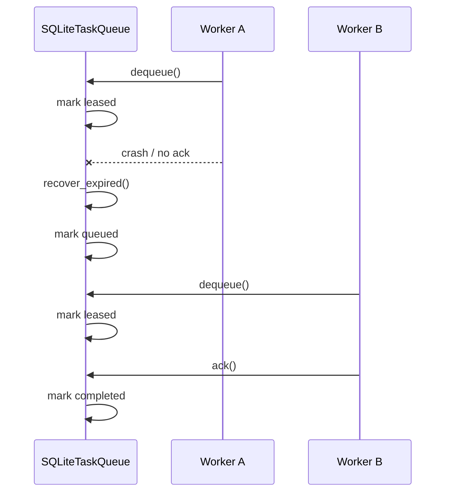

# Sprint 13 Reliability & Distributed Execution Architecture

Sprint 13 turns AllBrain reliability into an explicit subsystem while preserving the event-sourced architecture. The default runtime remains unchanged: `InMemoryTaskQueue` is still the default, SchedulerV1 behavior is not replaced, and MCP tools remain backward compatible.

## Subsystems

- `allbrain.reliability`: idempotency, duplicate detection, worker heartbeat, leases, resource tracking, graceful shutdown, and reliability metrics.
- `allbrain.agents.queues`: queue backend adapters. SQLite is the real persistent backend in Sprint 13; Redis and RabbitMQ are metadata-first stubs.
- `allbrain.snapshot`: workflow and graph snapshots plus snapshot restore manager layered on top of the existing snapshot store.
- Observability API: existing system metrics are extended with a `reliability` section, and `get_reliability_status` exposes the same event-derived reliability metrics directly.

## Event Additions

Sprint 13 adds event types for duplicate detection, idempotency recording, lease lifecycle, task requeue, worker heartbeat/staleness, recovery lifecycle, resource closure, and snapshot restore. Payloads should include stable identifiers where available: `workflow_id`, `task_id`, `node_id`, `agent_id`, `worker_id`, `lease_id`, `queue_backend`, `idempotency_key`, and `reason`.

## Queue State Model

```text
queued -> leased -> completed
queued -> leased -> failed -> queued
queued -> leased -> lease_expired -> queued
queued -> deduplicated
```

SQLite queue records store the serialized `QueueItem` payload plus indexed workflow/task/node/agent/idempotency fields. Duplicate active queue items are ignored; they do not remove or consume the original work item.

## Recovery Flow



Defaults:

- `max_attempts = 3`
- `lease_ttl_seconds = 60`
- `heartbeat_interval_seconds = 10`
- `stale_worker_after_seconds = 30`

## Lifecycle

Runtime owners register closeable resources with `ResourceTracker` or `ShutdownManager`. Shutdown stops accepting new work, closes resources in reverse registration order, and disposes owned DB engines through explicit `close()` methods.

## Snapshot Restore

Snapshot restore uses the latest compatible snapshot, then replays only events after the snapshot cursor. Workflow snapshots store task state; graph snapshots store graph intelligence state. Tests compare snapshot restore with full replay/rebuild to detect drift.

## Rollout

- Keep InMemory queue as default.
- Make SQLite queue opt-in.
- Keep Redis/RabbitMQ as dependency-free stubs until real deployment configuration exists.
- Treat reliability metrics as passive, event-derived, additive observability data.
